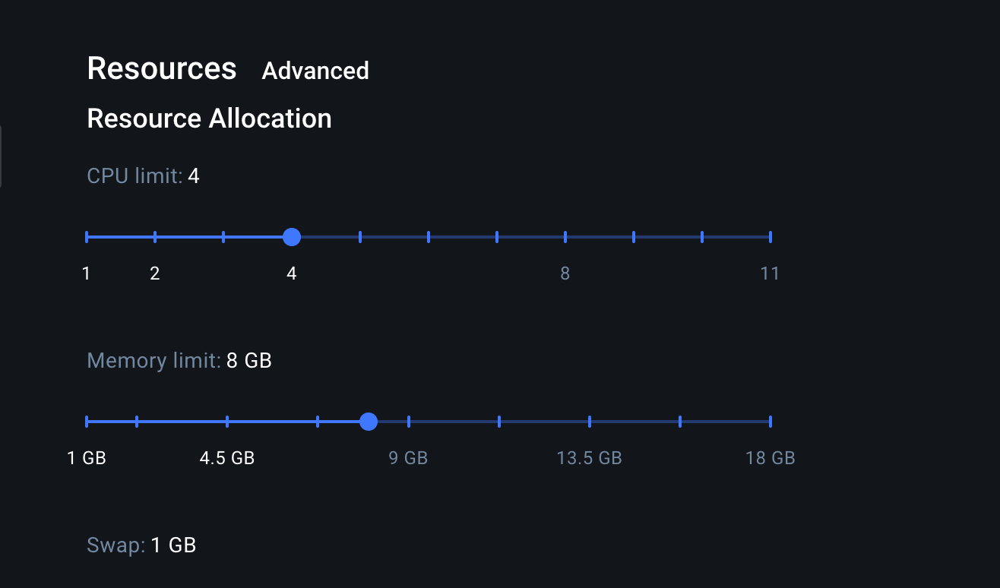

# 🧪 SuperDoc E2E Tests

This repository contains multiple e2e tests for SuperDoc. The test suite here is triggered every time someone opens a pull request in the SuperDoc repo.

## 📋 Table of Contents

- [📋 Requirements to run locally](#-requirements-to-run-locally)
- [🏃‍♂️ Running locally](#%E2%80%8D%EF%B8%8F-running-locally)
- [📷 Visual diffing](#-visual-diffing)
  - [📄 Adding extra documents](#-adding-extra-documents)
    - [🔄 Updating Reference Screenshots](#-updating-reference-screenshots)
      - [New document](#new-document)
      - [After intentional UI changes](#after-intentional-ui-changes)
- [🏎️ Performance](#%EF%B8%8F-performance)
  - [Load time](#load-time)
  - [Keyboard interaction response time](#keyboard-interaction-response-time)
- [⛏️ Toolbar](#%EF%B8%8F-toolbar)
- [🔤 Fonts](#-fonts)
- [🐳 Why we use Docker](#-why-we-use-docker)

## 📋 Requirements to run locally

At this point, you should probably have them installed, but it's good to know we will need:

- Docker
- NodeJS
- NPM

> [!IMPORTANT]  
> Set some minimum resources on Docker, otherwise the tests might take too long to execute and might even produce wrong results.
> _RAM_: >= 8GB
> _CPUs_ >= 4



## 🏃‍♂️ Running locally

To run the tests locally you have to first build the docker image, and then run the tests.

### Quick Start (Recommended)

If you've made changes to SuperDoc code and want to rebuild everything:

```bash
npm run rebuild
npm run test:local
```

The `rebuild` command will:

- Build and pack SuperDoc (including super-editor)
- Copy the package to e2e-tests
- Install it in the test template
- Rebuild the Docker image with no cache

If you only need to refresh the Vue test app with the latest SuperDoc build (no Docker rebuild), run:

```bash
npm run reinstall
```

### Step-by-Step

Alternatively, you can run each step individually:

1. `npm run build:superdoc` - this will build SuperDoc and use it on the test app
2. `npm run build` - this will build the Docker image where the tests are executed
3. `npm run test:local` - this executes the tests on docker

### Layout-engine-only visuals

- Run locally (uses your current OS snapshots): `npm run test:layout`
- Update layout-engine snapshots locally: `npm run update-screenshots:layout`
- Update layout-engine snapshots in Docker: `npm run update-screenshots:layout:docker`

> **Note:** If tests fail after making code changes, use `npm run rebuild` instead of just `npm run build` to ensure Docker doesn't use cached layers with old code.

## 📷 Visual diffing

Visual diffing is, in short, screenshot-based testing. We have a set of reference screenshots taken from documents to compare against new changes to SuperDoc. The comparison is made pixel-by-pixel between the reference screenshot and the screenshot taken of the same document using the code in the pull request that triggered the test execution.

More details [here](https://playwright.dev/docs/test-snapshots).

### 📄 Adding extra documents

If you want to add a new document to the existing visual diffing test suite, simply drag and drop in a folder under `test-data/basic-documents`.

When the test suite runs after this, it will not have a reference screenshot, so you need to follow the steps below.

#### 🔄 Updating Reference Screenshots

You might need to update the reference screenshot in 2 situations:

1. Adding a new document to be tested
2. After intentional UI changes to existing documents

##### New document

1. Drag and drop a document into the folder: `test-data/basic-documents`. Make sure to follow the same naming standard.
2. From this folder (`e2e-tests`), run `npm run update-screenshots`
3. Ensure the screenshot was generated properly under `tests/visuals/basic-documents.spec.js-snapshots`.
4. Double-check that no other screenshot was updated by mistake since `npm run update-screenshots` updates all screenshots (if they are different from the current ones).
5. Open a PR with the changes.

##### After intentional UI changes

1. Run `npm run update-screenshots` from this folder (`e2e-tests`). Make sure that you're on the correct branch (ie, the branch that is introducing the UI change)
2. Double-check that no other screenshot was updated by mistake since `npm run update-screenshots` updates all screenshots (if they are different from the current ones).
3. Open a PR with the changes.

## 🏎️ Performance

We currently have 2 types of performance tests:

### Load time

Ensures that documents of different sizes load within a reasonable time.

**Example**: loads a document with 100 pages in less than 3 seconds.

### Keyboard interaction response time

Ensures that keyboard interactions respond in a timely manner.

**Example**: if the user types "a" in a document with 300 pages, it should take effect almost immediately; otherwise, it creates a bad typing experience.

## ⛏️ Toolbar

Toolbar-related tests simulate user interactions with the editor and the toolbar, expecting them to produce the correct output.

**Examples**:

1. clicks the "bold" toolbar button, types "a", and expects "a" to be bold
2. selects existing text, clicks the "italic" toolbar button, and expects the selected text to be italic
3. selects existing text, presses "cmd + B", and expects the selected text to be bold
4. tests that custom buttons added by the developer work as expected

## 🔤 Fonts

Fonts-related tests simulates real-word scenarios where developers provide the `onFontsResolved` callback to SuperDoc. We expect it to work as expected, providing all the document fonts as well as unsupported fonts.

**Examples**:

1. loads a document with only unsupported fonts and expects `unsupportedFonts` to have them
2. loads a document with embedded fonts and expects `unsupportedFonts` to not have them since they should have been imported
3. loads a document with only supported fonts and expects `unsupportedFonts` to be empty

## 🐳 Why we use Docker

You might be asking yourself... why do we need Docker to run the tests locally? And that's a great question. There are a few reasons why:

### Consistency

When someone opens a PR, we will trigger a GitHub Action to execute the tests. They will run on a Linux VM, and it will almost always be different than our local machines. By running the tests on a Docker environment, we can control exactly what environment the test will be executed on, and it should always be consistent with the executions on CI-CD. This is especially important for visual diffing as screenshots taken on different OS's will always look different. This doesn't mean they look better or worse, only that for a pixel-by-pixel comparison algorithm (like ours), this is is definitely not a good thing.

### Ease of debugging

Since we have consistency between CI-CD executions and our local machine's executions, the debugging process should be a lot simpler as the outputs should always be the same.

### Simpler process to update screenshots

From time to time, you might need to update the reference screenshots, or add new ones. Since we have consistency between CI-CD and local executions, we can simply update the screenshots on our local environments, open a PR and that's it! If we didn't have this consistency, this means we would have to maintain different sets of screenshots due to the fact that each environment might produce different screenshots. In fact, that's how we started - and we noticed it wouldn't be sustainable.
